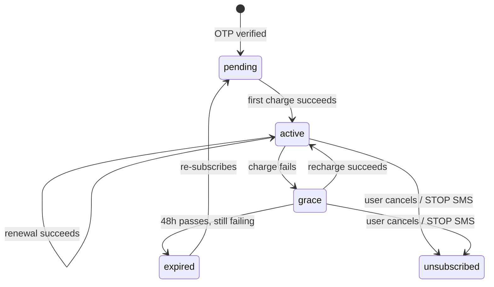

# How the interesting parts actually work

Skipping the CRUD-y stuff (plant listings, admin forms) and covering the
bits that have actual logic in them.

## Subscription state machine



`active` and `grace` are the only two states that grant access — checked
fresh from the DB on every gated request, never cached. `SubscriptionService`
owns every transition. The one thing worth remembering if you're touching
billing code: renewal extends `current_period_end` from the *previous*
period end, not from `now()`. If you extend from `now()`, every hour the
cron is late (and it will be, sometimes) quietly steals time from the user.
It adds up.

## Diagnosis scoring

The leaf-picker on `/app/diagnose` doesn't do anything fancy — it's a
weighted sum. Each symptom-to-problem pairing has a weight from 1–10
(`problem_symptoms.weight`, set by hand in the admin panel or the seed
data). Pick some symptoms, and for every problem that matches at least one
of them:

```
score = sum of weights for the symptoms that matched
confidence = score / (sum of weights for ALL of that problem's symptoms)
```

So a problem with ten linked symptoms doesn't automatically outrank one
with three just because it has more surface area — confidence is
normalized against its own total. Results above 70% confidence show as
"likely," 40–70% as "possible," below that as "unlikely." See
`App\Services\DiagnosisEngine` — it's short, worth just reading directly.

If a plant is specified and nothing matches for that specific plant, it
retries without the plant filter rather than showing an empty result — a
wrong-but-plausible guess beats "nothing found."

## Care scheduler

Runs once a day (`cron/care_tasks.php`) and once immediately whenever
someone adds a plant to their garden, so they see a schedule right away
instead of waiting for tomorrow's cron. For each plant it owns, it looks at:

- the plant's baseline watering interval (or a default based on whether
  it's low/medium/high water need, if the specific plant doesn't have one set)
- what season it currently is, in the Bangla calendar — monsoon roughly
  doubles the interval (rain does the watering for you), summer shortens it
- where the plant lives — indoor pots dry out slower, a rooftop in full
  summer sun dries out faster

and generates the next 7 days of watering/fertilizing tasks, using an
`INSERT IGNORE` on a unique key so running it twice in a day is harmless.

## Search

FULLTEXT when it's available (MySQL 8), `LIKE` fallback otherwise — see
DATABASE.md. Searches plants, problems, and guides in parallel and shows
whatever matched, grouped by type.

## Image uploads

Q&A questions can include a photo. The pipeline: check the actual file
content with `finfo` (never trust the extension or what the browser claims
the MIME type is), decode it with GD, re-encode it as a fresh JPEG. That
last step is what actually matters — decoding and re-encoding an image
throws away anything that isn't literally pixel data, which is how you kill
EXIF/GPS metadata and any payload smuggled inside a polyglot file, without
needing a dedicated malware scanner. Gets a random filename, stored outside
the web root, served back through a controller that sets the content type
itself rather than trusting anything about the original upload.

## Q&A moderation

New questions start `pending` and only the asker can see their own pending
question. An admin approves or rejects. Anyone with an active subscription
can answer an approved question; answers from users flagged as `expert`
(admin sets that flag) get a badge and sort first.

## Contact / support inbox

The public `/contact` form writes to `contact_messages`, not just the audit
log — the audit entry is a paper trail, the table is what actually shows up
in `/admin/contact`. New submissions start as `new`, flip to `read` the
moment an admin opens one, and `resolved` once someone marks it done. If
`SUPPORT_EMAIL` is set in `.env`, opening a message also fires a best-effort
heads-up email (`App\Services\Notifier`, plain `mail()`, no SMTP library) —
but the inbox itself is the real source of truth, so a bounced or unset
email is never the only way to find out someone wrote in.
